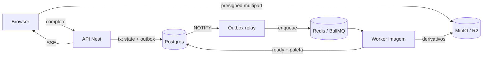
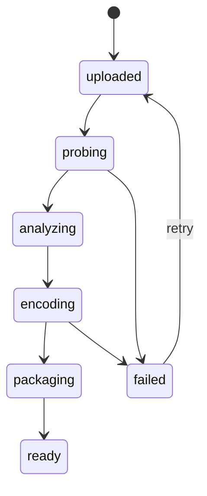

# Casebook — Plano de Sprints do MVP

Sep 23, 2026 · @Someone

## Premissas

O MVP sai em 9 sprints (\~17 semanas) a um ritmo de 12–15h por semana. Cada sprint termina com algo publicável de ponta a ponta — não existe sprint só de infra.

- **Cadência:** sprints de 2 semanas; a Sprint 0 tem 1 semana.
- **Ordem:** imagem antes de vídeo. O pipeline de imagem prova a arquitetura inteira (outbox, fila, worker, derivativos) com o caso mais barato de debugar; vídeo reaproveita tudo no fim.
- **Definição de pronto (vale para toda sprint):** roda em `docker compose up`, tem trace no SigNoz, typecheck e lint passando no CI, e erros em `problem+json` com `trace_id`.
- **Teste com usuários:** a partir da Sprint 4 o produto já é usável; é o ponto de colocar 2–3 amigos para testar.

| Sprint | Tema | Duração | Entrega visível |
| --- | --- | --- | --- |
| 0 | Fundação | 1 sem | Hello-world tracado de ponta a ponta |
| 1 | Auth + perfil | 2 sem | Cadastro, login, edição de perfil |
| 2 | Pipeline de imagem | 2 sem | Upload com derivativos e paleta em tempo real |
| 3 | Builder | 2 sem | Projeto montado com blocos reordenáveis |
| 4 | Publish + página pública | 2 sem | Link público compartilhável |
| 5 | Preview fiel | 1–2 sem | Preview mobile com tempo estimado de carga |
| 6 | Vídeo — encode | 2 sem | HLS gerado com alvo de SSIM |
| 7 | Vídeo — entrega | 2 sem | Bloco de vídeo tocando na página pública |
| 8 | Deploy | 2 sem | Casebook em produção na VPS |

## Sprint 0 — Fundação (1 semana)

**Objetivo:** `pnpm i && docker compose up` sobe o ambiente inteiro e um `GET /health` aparece tracado no SigNoz.

**Estrutura do monorepo**

| Pacote | Conteúdo |
| --- | --- |
| `apps/web` | Next.js 15 (App Router, output standalone) |
| `apps/api` | NestJS + Fastify adapter |
| `apps/worker-image` | Node + sharp + BullMQ |
| `apps/worker-video` | Python 3.12 + bullmq + PyAV (só esqueleto nesta sprint) |
| `packages/contracts` | Schemas Zod compartilhados (props de bloco, DTOs, payloads de job) |
| `packages/db` | Schema Drizzle, migrations, cliente |
| `packages/renderer` | Componentes de bloco usados pelo preview e pela página pública |
| `packages/config` | tsconfig, eslint, prettier base |

**Tarefas**

- [ ] pnpm workspaces + Turborepo com pipelines `build`, `lint`, `typecheck`, `test`
- [ ] `docker-compose.dev.yml` com Postgres 16, Redis 7 (`noeviction`), MinIO e SigNoz
- [ ] Container `minio-init` com `mc` criando os buckets `casebook-originals` (privado) e `casebook-media` (público)
- [ ] Schema Drizzle das 11 tabelas do DDL, incluindo índice parcial, enums nativos e `ON DELETE RESTRICT` em `block_media`
- [ ] `drizzle-kit generate` + primeira migration revisada à mão
- [ ] `DatabaseModule` global no Nest com provider `DB`
- [ ] SDK OpenTelemetry no Nest (auto-instrumentação de HTTP, pg e ioredis) exportando para o collector
- [ ] `ExceptionFilter` global emitindo RFC 9457 com `trace_id`
- [ ] Validação de env com Zod em cada app (falha no boot se faltar variável)
- [ ] Dockerfiles multi-stage para os 4 apps
- [ ] GitHub Actions: lint + typecheck + build de imagens em todo PR

**Critério de pronto:** clone limpo → ambiente de pé em menos de 5 minutos → trace do `/health` visível com spans de HTTP e de query no Postgres.

**Armadilha:** não adiar o OTel. Instrumentar depois nunca acontece, e o trace atravessando a fila (Sprint 2) depende dessa base.

## Sprint 1 — Auth + perfil (2 semanas)

**Objetivo:** um usuário se cadastra, loga, mantém sessão com refresh rotativo e edita o perfil público.

**Backend**

- [ ] Hash com `argon2id` (memory 64MB, iterations 3, parallelism 1)
- [ ] `POST /auth/signup`, `/login`, `/refresh`, `/logout`
- [ ] Access token JWT de 15 min, mantido em memória no client
- [ ] Refresh token opaco (32 bytes) em cookie `httpOnly; Secure; SameSite=Lax`, salvo hasheado (SHA-256) no banco
- [ ] Rotação a cada refresh com `family_id`: reuso de token já rotacionado revoga a família inteira
- [ ] `AuthGuard` global + `@Public()` + `@CurrentUser()`
- [ ] Rate limit no Redis (db 1): 5 tentativas de login por IP+email a cada 15 min
- [ ] `GET /me` e `PATCH /me/profile` (handle único, nome, bio, links, especialidades)
- [ ] Validação de handle: regex, lista de reservados (`api`, `admin`, `u`, `app`…), case-insensitive via índice em `lower(handle)`
- [ ] Registro em `audit_log` para login, logout e reuso detectado

**Frontend**

- [ ] Telas de cadastro e login (fluxo 1 dos mocks)
- [ ] Cliente HTTP com refresh automático em 401 e fila de requisições pendentes durante o refresh
- [ ] `middleware.ts` do Next protegendo `/(app)`
- [ ] App shell: navegação, menu de conta, estado vazio
- [ ] Tela de edição de perfil

**Testes**

- [ ] Integração do fluxo de refresh e da detecção de reuso contra Postgres real (Testcontainers)

**Critério de pronto:** fluxo completo no browser; roubar um refresh já usado derruba a sessão do usuário legítimo; todo 401/409/429 volta em `problem+json`.

**Armadilha:** refresh em paralelo. Duas abas pedindo refresh ao mesmo tempo disparam falso positivo de reuso. Resolva com janela de graça de \~10s em que o token anterior ainda devolve o mesmo par novo.

## Sprint 2 — Upload + pipeline de imagem (2 semanas)

**Objetivo:** subir uma foto e ver derivativos e paleta prontos em tempo real, com um único `trace_id` do clique ao arquivo no bucket. É a sprint mais importante do MVP: ela prova a arquitetura inteira.

O outbox garante que nenhum upload confirmado fica sem job, mesmo se o Redis cair entre o commit e o enqueue.

**Upload**

- [ ] `POST /media/uploads` → valida MIME/tamanho, cria `media_asset` em `pending` e devolve URLs presigned por parte (partes de 10MB)
- [ ] Upload direto do browser com progresso por parte e retry por parte
- [ ] `POST /media/:id/complete` → `CompleteMultipartUpload` + transação (`state='uploaded'`, insert em `outbox_events`, `pg_notify`)
- [ ] Job de limpeza de multipart abandonado (> 24h)

**Outbox relay**

- [ ] Processo dedicado com `LISTEN outbox` + poll de fallback a cada 5s
- [ ] `SELECT … FOR UPDATE SKIP LOCKED` em lote, publica no BullMQ com `jobId = event.id` (idempotência) e marca `dispatched_at`
- [ ] `traceparent` injetado no payload do job

**Worker de imagem**

- [ ] Consumo da fila `image` com concorrência 4, contexto OTel reconstruído do payload
- [ ] Normalização: EXIF orientation aplicado, perfil de cor convertido para sRGB, metadados sensíveis (GPS) removidos
- [ ] Derivativos AVIF / WebP / JPEG em 320, 640, 1024, 1600 e 2400px (sem upscale)
- [ ] Paleta: resize 100px → k-means (k=6) em Lab → `ratio` + contraste WCAG contra branco e preto → `suggested` bg/fg/accent
- [ ] Grava `media_derivatives`, `palette` e `state='ready'`; falha vai para `failed` com motivo legível

**Tempo real e UI**

- [ ] `GET /media/events` (SSE) alimentado por Redis pub/sub, filtrado por usuário
- [ ] Biblioteca de mídia: grid, estados (enviando / processando / pronto / falhou), retry, detalhes técnicos (RF-LIB-4)
- [ ] Soft delete bloqueado se a mídia estiver em uso por um bloco

**Critério de pronto:** o trace `upload.complete → outbox.relay → queue.enqueue → worker.process → derivative.upload` aparece inteiro no SigNoz; derrubar o Redis durante um upload não perde o job.

**Armadilha:** o BullMQ não propaga contexto OTel sozinho. Sem o `traceparent` no payload, o trace quebra em dois e a principal demonstração técnica da sprint some.

## Sprint 3 — Builder (2 semanas)

**Objetivo:** montar um projeto com os 9 tipos de bloco, reordenar arrastando, recarregar a página e encontrar tudo exatamente como estava.

**Contratos**

- [ ] Discriminated union Zod em `packages/contracts` para `cover`, `text`, `image`, `gallery_grid`, `fullbleed`, `split`, `carousel`, `video`, `spacer`, todos com `schema_version: 1`
- [ ] Mesmo schema validando no autosave do client e no `PATCH /blocks/:id`
- [ ] Tipo do JSONB no Drizzle via `$type<BlockProps>()`

**Projetos e blocos (API)**

- [ ] CRUD de projeto com slug único por usuário (índice parcial ignora soft-deleted)
- [ ] `POST /projects/:id/blocks`, `PATCH /blocks/:id`, `DELETE`, `POST /blocks/:id/duplicate`
- [ ] `POST /blocks/:id/move` recebendo o rank já calculado; 1 UPDATE
- [ ] Rebalanceamento dos ranks do projeto quando o comprimento passa de 32 chars (transação única)
- [ ] `version` no projeto: todo write exige `If-Match`, conflito devolve 409 com a versão atual
- [ ] Associação de mídia em `block_media` com `role`, `position` e `crop` normalizado 0..1

**Builder (front)**

- [ ] Layout de 3 colunas dos mocks: paleta de blocos, canvas, painel de propriedades
- [ ] Reordenação com dnd-kit; rank calculado entre vizinhos no client e aplicado de forma otimista
- [ ] Store Zustand do documento com histórico (undo/redo, limite de 100 passos)
- [ ] Autosave com debounce de 2s e indicador salvo/salvando/erro
- [ ] UI de conflito 409: recarregar versão do servidor ou sobrescrever
- [ ] Seletor de mídia reaproveitando a biblioteca da Sprint 2
- [ ] Editor de crop por bloco

**Testes**

- [ ] Property-based test do LexoRank (fast-check): mil inserções aleatórias mantêm ordem total

**Critério de pronto:** projeto com 10+ blocos, reordenado várias vezes, sobrevive a reload e a duas abas editando (a segunda recebe o 409 e se recupera).

**Armadilha:** undo/redo e autosave brigam. Trate o histórico como fonte de verdade local e deixe o autosave só persistir o estado atual — nunca sincronize o histórico com o servidor.

## Sprint 4 — Publish + página pública (2 semanas)

**Objetivo:** gerar um link público rápido no celular, servido a partir de um snapshot imutável. Ao fim desta sprint o Casebook já é usável por um amigo.

**Publicação**

- [ ] `POST /projects/:id/publish` → resolve blocos + derivativos + paleta num `document` JSONB self-contained em `project_versions`
- [ ] Bloqueio se algum bloco referencia mídia fora de `ready` (RF-BLD-7), com lista dos blocos problemáticos
- [ ] `unpublish`, `GET /versions` e `revert/:versionId` (copia o snapshot de volta ao rascunho)
- [ ] Invalidação do cache do Next por tag no publish/unpublish

**Renderer compartilhado**

- [ ] `packages/renderer` com um componente por tipo de bloco, despachado por `type` + `schema_version`
- [ ] Mesma árvore renderizando rascunho (preview) e snapshot (público)
- [ ] `<picture>` AVIF → WebP → JPEG com `srcset`/`sizes` por layout de bloco
- [ ] `loading="lazy"` fora da primeira dobra, `fetchpriority="high"` na capa
- [ ] `width`/`height` explícitos em toda imagem (CLS zero)
- [ ] Paleta em CSS custom properties, com override manual salvo no projeto

**Rotas públicas**

- [ ] `/u/:handle` → grid de projetos publicados
- [ ] `/u/:handle/:slug` → RSC, `ETag = version_id`, `Cache-Control` público
- [ ] Meta OG/Twitter por projeto usando o derivativo 1200px da capa
- [ ] 404 próprio para handle ou slug inexistente

**Critério de pronto:** Lighthouse mobile ≥ 90 em performance numa página com 20 imagens; publicar de novo muda o ETag e o conteúdo sem precisar limpar cache.

**Armadilha:** o snapshot precisa ser realmente self-contained. Se o renderer público consultar `media_assets` em tempo de request, deletar uma mídia quebra uma página já publicada — exatamente o que a imutabilidade deveria impedir.

## Sprint 5 — Preview fiel (1–2 semanas)

**Objetivo:** o usuário vê antes de publicar como a página fica no celular, quanto pesa e quanto demora a carregar — com números determinísticos, não simulação de rede no browser.

- [ ] Toggle desktop/mobile renderizando o mesmo `packages/renderer` num iframe com largura fixa (1440px / 390px)
- [ ] `GET /projects/:id/preview-budget?viewport=mobile` → para cada imagem, escolhe o derivativo que o `srcset`/`sizes` selecionaria naquele viewport e soma os bytes
- [ ] Separação primeira dobra vs. resto da página
- [ ] Estimativa de tempo contra perfis fixos: 4G lento (1.6 Mbps, RTT 150ms) e Wi-Fi (20 Mbps, RTT 30ms)
- [ ] Aviso de corte: se o `crop` de um bloco no aspect ratio mobile esconde mais de 25% da imagem, destaca o bloco
- [ ] Aviso de peso: página mobile acima de 3MB na primeira dobra
- [ ] Painel de avisos clicável levando ao bloco no builder

**Critério de pronto:** o tempo estimado para 4G lento fica dentro de ±20% de uma medição real com throttling do Chrome DevTools na mesma página.

**Armadilha:** a lógica de escolha de derivativo precisa ser a mesma do renderer. Extraia a função que monta `srcset`/`sizes` para `packages/renderer` e use-a nos dois lugares, senão o orçamento mente.

Se o prazo apertar, esta é a sprint que pode encolher: o toggle desktop/mobile sozinho já entrega metade do valor.

## Sprints 6–7 — Vídeo (4 semanas)

Vídeo entra por último de propósito: reaproveita upload, outbox, fila, SSE, renderer e publicação. O que é novo é só o worker Python e o player.

### Sprint 6 — Encode

**Objetivo:** um upload de vídeo vira um HLS multi-resolução com qualidade alvo por SSIM, com progresso ao vivo.

- [ ] Worker Python com `bullmq` oficial, concorrência 1, `lockDuration` de 15 min com renovação
- [ ] Probe com PyAV: resolução, fps, duração, codec, HDR/SDR, rotação
- [ ] Ladder adaptativo à fonte: 360p@800k, 540p@1400k, 720p@2800k, 1080p@5000k, 1440p@9000k (só se a fonte ≥ 1440p)
- [ ] H.264 High, GOP fixo de 2s alinhado entre renditions, segmentos de 4s
- [ ] Busca de CRF: encode de 3 trechos de 5s → SSIM com scikit-image contra a fonte → binary search até SSIM ≥ 0.97, com cap de bitrate da ladder
- [ ] Cache do CRF resolvido por (resolução, complexidade estimada)
- [ ] Poster: amostra 30 frames, escolhe o de maior nitidez (variância do Laplaciano) evitando frames escuros
- [ ] Progresso via `-progress pipe:1` → banco → Redis pub/sub → SSE existente
- [ ] Upload de segmentos e `master.m3u8` para `casebook-media`
- [ ] OTel Python reconstruindo contexto do `traceparent` do job

**Critério de pronto:** vídeo 1080p de 2 min processado em menos de 10 min na máquina de dev, com trace contínuo desde o upload.

### Sprint 7 — Entrega

**Objetivo:** o bloco de vídeo funciona no builder e na página pública, em qualquer browser.

- [ ] Bloco `video` no builder com escolha de poster (automático ou frame manual)
- [ ] Player: HLS nativo no Safari, `hls.js` carregado sob demanda no resto
- [ ] Sem autoplay com som; autoplay mudo opcional para loops curtos
- [ ] Seleção de rendition inicial pela largura do bloco, não pela tela
- [ ] Download do master original por URL presigned de curta duração (opt-in do autor)
- [ ] Falha de encode com motivo legível na UI (codec não suportado, arquivo corrompido, duração acima do limite)
- [ ] Preview-budget da Sprint 5 contando o poster e o primeiro segmento

**Critério de pronto:** vídeo publicado toca em Safari iOS, Chrome Android e Firefox desktop, trocando de rendition ao mudar o throttling.

**Armadilha:** iteração lenta em dev. Mantenha uma pasta de 5 vídeos de teste curtos (10–20s, variando resolução, HDR, rotação e VFR) e só use vídeo longo no teste final.

## Sprint 8 — Deploy (2 semanas)

**Objetivo:** Casebook em produção em duas VPS Hetzner, com deploy automático, TLS, backup e observabilidade.

| Máquina | Plano | Serviços |
| --- | --- | --- |
| `casebook-app` | CPX21 (3 vCPU, 4GB) | Caddy, Next, API, outbox relay, Postgres, Redis |
| `casebook-worker` | CPX41 (8 vCPU, 16GB) | Worker de imagem, worker de vídeo, SigNoz |

**Infra**

- [ ] Provisionamento com usuário não-root, SSH só por chave, `ufw` liberando 22/80/443
- [ ] Rede privada Hetzner entre as duas máquinas; Redis e Postgres escutando só nela
- [ ] Cloudflare R2 com os dois buckets e domínio `cdn.casebook.app` no bucket público
- [ ] CORS do bucket de originais restrito ao domínio do app
- [ ] `docker-compose.prod.yml` por máquina, com `restart: unless-stopped` e healthchecks
- [ ] Caddy com TLS automático e headers de segurança (HSTS, CSP básica)

**Entrega contínua**

- [ ] GitHub Actions: build das imagens com tag do commit → push no GHCR
- [ ] Job de deploy por SSH: `docker compose pull && up -d`, migrations rodando antes da API subir
- [ ] Rollback documentado: redeploy da tag anterior

**Operação**

- [ ] `pg_dump` diário para o R2 com retenção de 30 dias
- [ ] Teste de restore do backup numa máquina limpa (sem isso o backup não existe)
- [ ] Alertas no SigNoz: taxa de erro 5xx, fila `video` com jobs parados, disco acima de 80%
- [ ] Secrets fora do repo (`.env` no servidor com permissão 600)

**Critério de pronto:** um merge na `main` chega em produção sem intervenção manual; um amigo cria conta, sobe foto e vídeo e publica um projeto na URL real.

## Riscos e cortes possíveis

As Sprints 2 e 6 são as mais prováveis de estourar: a 2 junta presigned multipart, outbox e SSE pela primeira vez; a 6 tem iteração lenta por causa do tempo de encode.

| Risco | Sprint | Mitigação | Corte se apertar |
| --- | --- | --- | --- |
| Outbox + SSE + multipart juntos | 2 | Fazer upload simples (PUT único) primeiro, multipart depois | Multipart só para arquivos acima de 50MB |
| Busca de CRF por SSIM lenta em dev | 6 | Trechos de amostra curtos e cache de CRF | CRF fixo por resolução no MVP, SSIM entra depois |
| Conflito undo/redo × autosave | 3 | Histórico só local | Undo limitado à sessão atual |
| Estimativa de carga imprecisa | 5 | Função de `srcset` compartilhada | Só toggle desktop/mobile + peso em MB |
| Codecs e VFR exóticos de câmera | 6–7 | Pasta de vídeos de teste variados | Rejeitar com mensagem clara em vez de suportar |

## Fase 2 (fora do MVP)

- Discovery com filtros por papel na produção, formato e equipamento (Postgres full-text; Meilisearch se a busca facetada exigir)
- Showreel automático com detecção de cena (PySceneDetect)
- Transparência de moderação: motivo explícito e histórico visível para toda ação sobre a conta
- Social: seguir, apreciar, coleções
